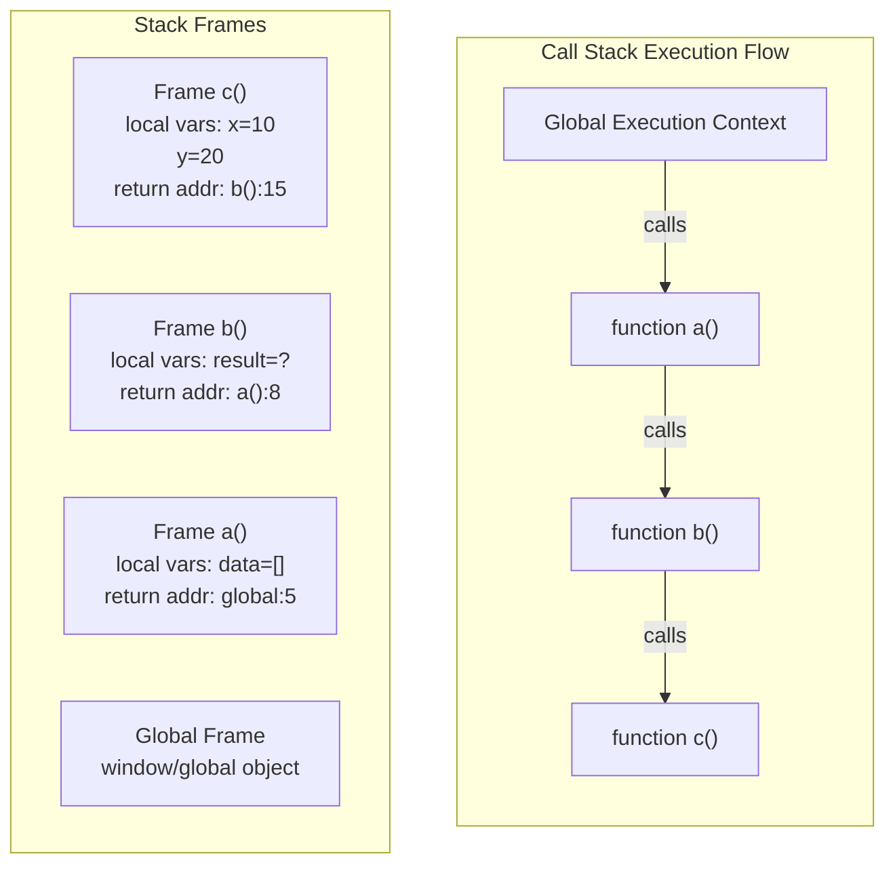

The Call Stack is a LIFO (Last In, First Out) data structure that tracks function execution in JavaScript. Each function call creates a stack frame containing arguments, local variables, and return address.

## How the Call Stack Works



## Call Stack Example

```javascript
// Example demonstrating call stack behavior
function firstFunction() {
  console.log("1. Entering firstFunction");
  secondFunction();
  console.log("4. Exiting firstFunction");
}

function secondFunction() {
  console.log("2. Entering secondFunction");
  thirdFunction();
  console.log("3. Exiting secondFunction");
}

function thirdFunction() {
  console.log("3. Inside thirdFunction");
  throw new Error("Stack trace demo");
}

// Call stack grows: global → firstFunction → secondFunction → thirdFunction
// Then unwinds: thirdFunction → secondFunction → firstFunction → global
firstFunction();

// Stack overflow example
function recursion(n) {
  if (n === 0) return "done";
  return recursion(n - 1); // Each call adds to stack
}
// recursion(100000); // RangeError: Maximum call stack size exceeded
```

## Stack Frame Components

```javascript
// Each stack frame contains:
function demonstrateStackFrame(a, b) {
  // 1. Arguments
  console.log(arguments); // { 0: a, 1: b }

  // 2. Local variables
  let localVar = "I'm local";
  const constVar = 42;

  // 3. Return address (implicit)
  // 4. Previous frame pointer (implicit)

  function innerFunction() {
    // Closure reference to outer scope
    console.log(localVar);
  }

  return innerFunction;
}

// View stack trace
function getCurrentStack() {
  const stack = new Error().stack;
  console.log("Current stack:\n", stack);
}

function levelOne() {
  levelTwo();
}

function levelTwo() {
  levelThree();
}

function levelThree() {
  getCurrentStack();
}

levelOne();
```

## Stack Size Limitations

```javascript
// Maximum call stack size varies by environment
// Browser: ~10,000-50,000 frames
// Node.js: ~10,000-20,000 frames

// Calculate stack limit
function measureStackLimit() {
  let count = 0;
  try {
    function recurse() {
      count++;
      recurse();
    }
    recurse();
  } catch (e) {
    console.log(`Maximum stack depth: ${count}`);
  }
}
measureStackLimit();

// Optimizing recursion to avoid stack overflow
// Bad - recursive
function factorialRecursive(n) {
  if (n <= 1) return 1;
  return n * factorialRecursive(n - 1);
}

// Good - iterative
function factorialIterative(n) {
  let result = 1;
  for (let i = 2; i <= n; i++) {
    result *= i;
  }
  return result;
}

// Tail call optimization (strict mode, limited support)
function factorialTailRecursive(n, accumulator = 1) {
  if (n <= 1) return accumulator;
  return factorialTailRecursive(n - 1, n * accumulator);
}
```
