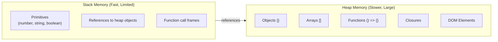

The Heap is an unstructured memory region where objects, functions, closures, and dynamically allocated data are stored. Unlike the stack, heap memory is managed by garbage collection and has no automatic cleanup.

## Stack vs Heap Memory



## Heap Memory Management

```javascript
// Stack vs Heap allocation
let primitiveNumber = 42; // Stored on Stack
let primitiveString = "hello"; // Stored on Stack
let primitiveBoolean = true; // Stored on Stack
let primitiveNull = null; // Stored on Stack
let primitiveUndefined = undefined; // Stored on Stack

let object = {
  // Stored on Heap
  name: "JavaScript", // Reference stored on Stack
  year: 1995,
};

let array = new Array(1000); // Stored on Heap
let function_ = function () {}; // Stored on Heap

// Heap memory allocation patterns
function demonstrateHeap() {
  // These all allocate memory on the heap
  const obj1 = { a: 1, b: 2, c: 3 };
  const obj2 = new Object();
  const arr1 = [1, 2, 3, 4, 5];
  const arr2 = new Array(1000000);
  const date = new Date();
  const regex = /pattern/g;
  const map = new Map();
  const set = new Set();

  // Closures capture heap references
  let counter = 0;
  return function () {
    return counter++; // 'counter' persists in heap via closure
  };
}

// Garbage collection examples
let reference = { data: new Array(1000000) };
reference = null; // Eligible for garbage collection

// WeakRef for non-critical references
let weakRef = new WeakRef({ data: "temporary" });
console.log(weakRef.deref()); // May be undefined if GC ran

// WeakMap and WeakSet for automatic cleanup
const weakMap = new WeakMap();
let obj = { id: 1 };
weakMap.set(obj, "metadata");
obj = null; // Both key and value can be garbage collected
```

## Heap Memory Monitoring

```javascript
// Monitor heap usage (Chrome/Node.js)
if (performance.memory) {
  setInterval(() => {
    console.log({
      totalHeap: (performance.memory.totalJSHeapSize / 1048576).toFixed(2) + " MB",
      usedHeap: (performance.memory.usedJSHeapSize / 1048576).toFixed(2) + " MB",
      heapLimit: (performance.memory.jsHeapSizeLimit / 1048576).toFixed(2) + " MB",
    });
  }, 5000);
}

// Node.js heap statistics
if (typeof global.gc === "function") {
  const heapStats = process.memoryUsage();
  console.log({
    rss: (heapStats.rss / 1048576).toFixed(2) + " MB",
    heapTotal: (heapStats.heapTotal / 1048576).toFixed(2) + " MB",
    heapUsed: (heapStats.heapUsed / 1048576).toFixed(2) + " MB",
    external: (heapStats.external / 1048576).toFixed(2) + " MB",
  });
}

// Detect memory leaks
class MemoryLeakDetector {
  constructor() {
    this.interval = null;
    this.baseline = null;
  }

  start() {
    this.baseline = process.memoryUsage().heapUsed;
    this.interval = setInterval(() => {
      const current = process.memoryUsage().heapUsed;
      const growth = (((current - this.baseline) / this.baseline) * 100).toFixed(2);

      if (growth > 50) {
        console.warn(`⚠️ Memory growth detected: ${growth}% increase`);
      }
    }, 10000);
  }

  stop() {
    clearInterval(this.interval);
  }
}

const detector = new MemoryLeakDetector();
// detector.start();
```

## Common Heap Problems

```javascript
// 1. Memory Leak - Global cache never cleared
let globalCache = new Map();
function memoryLeak() {
  const largeData = new Array(1000000).fill("data");
  globalCache.set(Date.now(), largeData); // Never cleared - LEAK
}

// 2. Detached DOM elements (browser)
function detachedDOMLeak() {
  let element = document.createElement("div");
  document.body.appendChild(element);
  // Element removed from DOM but still referenced
  element.remove();
  // 'element' still references the DOM node - LEAK
  // Fix: element = null;
}

// 3. Event listeners not removed
function eventListenerLeak() {
  const element = document.getElementById("button");
  function handler() {
    console.log("clicked");
  }
  element.addEventListener("click", handler);
  // Listener never removed - LEAK if element stays in memory
  // Fix: element.removeEventListener('click', handler);
}

// 4. Closures holding large data
function closureLeak() {
  const hugeArray = new Array(1000000).fill("data");
  return function () {
    // Returns reference to hugeArray
    return hugeArray.length;
  };
}
const leaked = closureLeak(); // hugeArray never released

// Proper cleanup patterns
function properCleanup() {
  // Use local references that go out of scope
  const largeData = new Array(1000000).fill("data");
  processData(largeData);
  // No external reference - eligible for GC
}

function processData(data) {
  // Process and discard
  console.log(data.length);
}
```
