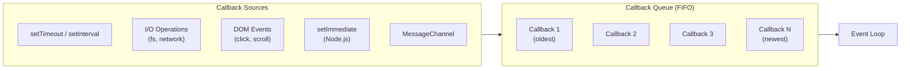

# 18.1.4 Callback Queue (Task Queue)

The Callback Queue (also known as the Task Queue or Macrotask Queue) is a FIFO (First In, First Out) data structure that holds callbacks from asynchronous operations ready to be executed. The event loop moves these callbacks to the call stack when the stack is empty.

## Callback Queue Sources



## Callback Queue Example

```javascript
console.log("=== Callback Queue Demo ===");

// Multiple callbacks queued in FIFO order
setTimeout(() => console.log("Task 1 (100ms)"), 100);
setTimeout(() => console.log("Task 2 (50ms)"), 50);
setTimeout(() => console.log("Task 3 (0ms)"), 0);
setTimeout(() => console.log("Task 4 (0ms)"), 0);

// I/O callbacks (Node.js)
const fs = require("fs");
fs.readFile("file1.txt", () => console.log("File 1 done"));
fs.readFile("file2.txt", () => console.log("File 2 done"));

// Event listeners
button.addEventListener("click", () => {
  console.log("Click event in callback queue");
});

// Queue behavior demonstration
console.log("Start");
setTimeout(() => console.log("Timeout 1"), 0);
setTimeout(() => console.log("Timeout 2"), 0);
Promise.resolve().then(() => console.log("Promise 1"));
console.log("End");

// Output order:
// Start
// End
// Promise 1 (microtask queue - higher priority)
// Timeout 1 (callback queue)
// Timeout 2 (callback queue)

// Understanding queue order
function demonstrateQueueOrder() {
  console.log("1: Synchronous");

  setTimeout(() => console.log("2: Timeout 0ms"), 0);
  setTimeout(() => console.log("3: Timeout 10ms"), 10);
  setTimeout(() => console.log("4: Timeout 5ms"), 5);
  setTimeout(() => console.log("5: Timeout 0ms"), 0);

  console.log("6: Synchronous end");
}

demonstrateQueueOrder();
// Output order may vary based on timer precision
// Typically: 1, 6, 2, 5, 4, 3
```

## Queue Size and Performance

```javascript
// Monitoring callback queue size
class CallbackQueueMonitor {
  constructor() {
    this.callbackCount = 0;
    this.interval = null;
  }

  start() {
    let lastTimestamp = Date.now();

    this.interval = setInterval(() => {
      const now = Date.now();
      const delay = now - lastTimestamp;
      lastTimestamp = now;

      if (delay > 100) {
        console.warn(`⚠️ Queue backlog detected: ${delay}ms delay`);
        console.warn(`   Callbacks may be piling up`);
      }
    }, 100);
  }

  stop() {
    clearInterval(this.interval);
  }
}

// Performance impact of large queues
function performanceTest() {
  console.time("Queue 100 callbacks");
  for (let i = 0; i < 100; i++) {
    setTimeout(() => {}, 0);
  }
  console.timeEnd("Queue 100 callbacks");

  console.time("Queue 10000 callbacks");
  for (let i = 0; i < 10000; i++) {
    setTimeout(() => {}, 0);
  }
  console.timeEnd("Queue 10000 callbacks");
}

performanceTest();

// Preventing queue buildup
class QueueOptimizer {
  constructor() {
    this.pendingTasks = [];
    this.processing = false;
  }

  addTask(task) {
    this.pendingTasks.push(task);
    if (!this.processing) {
      this.processBatch();
    }
  }

  processBatch() {
    if (this.pendingTasks.length === 0) {
      this.processing = false;
      return;
    }

    this.processing = true;

    // Process only 10 tasks per event loop iteration
    const batch = this.pendingTasks.splice(0, 10);
    batch.forEach((task) => task());

    // Schedule next batch
    setTimeout(() => this.processBatch(), 0);
  }
}

const optimizer = new QueueOptimizer();
for (let i = 0; i < 1000; i++) {
  optimizer.addTask(() => console.log(`Task ${i}`));
}
```
