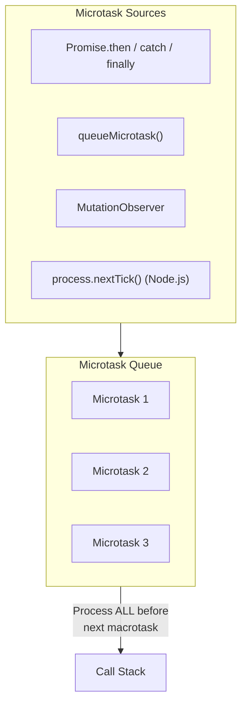

# 18.1.5 Microtask Queue

The Microtask Queue is a high-priority queue that handles Promise callbacks, `queueMicrotask()`, and MutationObserver callbacks. Unlike the callback queue (macrotasks), the microtask queue is processed completely before any macrotask, and before rendering in browsers.

## Microtask Sources



## Microtask Queue Priority

```javascript
console.log("=== Microtask Queue Priority ===");

// Different ways to create microtasks
Promise.resolve()
  .then(() => console.log("Promise microtask 1"))
  .then(() => console.log("Promise microtask 2"));

queueMicrotask(() => {
  console.log("queueMicrotask callback");
});

// MutationObserver (browser)
const observer = new MutationObserver(() => {
  console.log("MutationObserver microtask");
});

// Microtask queue processing demonstration
console.log("1: Synchronous start");

setTimeout(() => {
  console.log("6: Macrotask (setTimeout)");
}, 0);

Promise.resolve()
  .then(() => {
    console.log("2: Microtask 1");
  })
  .then(() => {
    console.log("4: Microtask 2");
  });

queueMicrotask(() => {
  console.log("3: queueMicrotask");
  // Microtasks can queue more microtasks
  queueMicrotask(() => {
    console.log("5: Nested microtask");
  });
});

console.log("1.5: Synchronous end");

// Output:
// 1: Synchronous start
// 1.5: Synchronous end
// 2: Microtask 1
// 3: queueMicrotask
// 4: Microtask 2
// 5: Nested microtask
// 6: Macrotask (setTimeout)
```

## Microtask Best Practices

```javascript
// 1. Using microtasks for high-priority updates
let pendingUpdates = false;
let updates = [];

function scheduleUpdate(update) {
  updates.push(update);

  if (!pendingUpdates) {
    pendingUpdates = true;
    queueMicrotask(() => {
      // Process all updates in one batch
      const batch = [...updates];
      updates = [];
      pendingUpdates = false;

      console.log(`Processing ${batch.length} updates`);
      batch.forEach((update) => update());
    });
  }
}

// Usage
for (let i = 0; i < 10; i++) {
  scheduleUpdate(() => console.log(`Update ${i}`));
}

// 2. Microtask starvation (BAD - blocks macrotasks)
function badMicrotaskStarvation() {
  function recursiveMicrotask() {
    queueMicrotask(() => {
      console.log("Microtask");
      recursiveMicrotask(); // Infinite microtasks
    });
  }
  recursiveMicrotask();
  // Macrotasks will NEVER execute!
}

// 3. Proper microtask usage
class MicrotaskBatchProcessor {
  constructor() {
    this.batch = [];
    this.scheduled = false;
  }

  add(item) {
    this.batch.push(item);

    if (!this.scheduled) {
      this.scheduled = true;
      queueMicrotask(() => this.process());
    }
  }

  process() {
    const items = [...this.batch];
    this.batch = [];
    this.scheduled = false;

    // Process batch
    items.forEach((item) => {
      console.log("Processing:", item);
    });
  }
}

const processor = new MicrotaskBatchProcessor();
for (let i = 0; i < 100; i++) {
  processor.add(`Item ${i}`);
}

// 4. Node.js specific - process.nextTick (highest priority)
if (typeof process !== "undefined") {
  process.nextTick(() => {
    console.log("nextTick - Before Promise microtasks");
  });

  Promise.resolve().then(() => {
    console.log("Promise - After nextTick");
  });
}
```

## Microtask vs Macrotask Performance

```javascript
// Performance comparison
console.log("=== Performance Comparison ===");

const iterations = 10000;

// Macrotasks
console.time("Macrotasks");
for (let i = 0; i < iterations; i++) {
  setTimeout(() => {}, 0);
}
console.timeEnd("Macrotasks");

// Microtasks
console.time("Microtasks");
for (let i = 0; i < iterations; i++) {
  Promise.resolve().then(() => {});
}
console.timeEnd("Microtasks");

// Microtasks are significantly faster to schedule
// Typical results on Node.js:
// Macrotasks: ~15ms
// Microtasks: ~5ms

// Real-world scenario: State updates
let state = { count: 0 };

// Bad - multiple separate microtasks
function badUpdate() {
  for (let i = 0; i < 100; i++) {
    Promise.resolve().then(() => {
      state.count++;
    });
  }
}

// Good - single microtask batch
function goodUpdate() {
  Promise.resolve().then(() => {
    for (let i = 0; i < 100; i++) {
      state.count++;
    }
  });
}

badUpdate();
// vs
goodUpdate();
```
