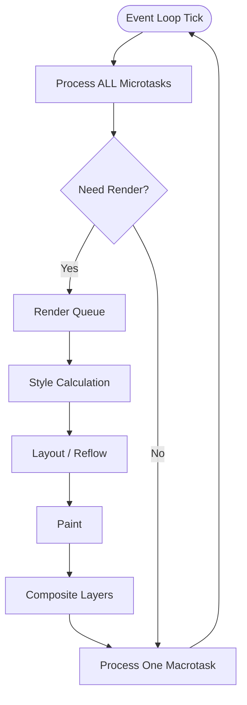

# 18.1.6 Render Queue

The Render Queue is a browser-specific queue that handles visual updates including repaints, reflows, and animation frames. It is processed between macrotasks, typically at 60fps (approximately every 16.6ms) to ensure smooth animations.

## Render Queue Flow



## Animation Frames

```javascript
console.log("=== Render Queue Operations ===");

// requestAnimationFrame - syncs with monitor refresh
function animate(timestamp) {
  console.log("Frame at:", timestamp);

  // Update DOM for next frame
  const element = document.getElementById("box");
  const time = Date.now() / 1000;
  const x = Math.sin(time) * 100;
  const y = Math.cos(time) * 100;

  element.style.transform = `translate(${x}px, ${y}px)`;

  requestAnimationFrame(animate);
}
// requestAnimationFrame(animate);

// Forcing reflow (layout thrashing - BAD)
function badReflow() {
  const elements = document.querySelectorAll(".item");

  for (let i = 0; i < elements.length; i++) {
    // Reading layout (triggers reflow)
    const width = elements[i].offsetWidth;
    // Writing layout (invalidates layout)
    elements[i].style.width = width + 10 + "px";
    // Next iteration will force another reflow
  }
}

// Batched DOM updates (GOOD)
function goodReflow() {
  const elements = document.querySelectorAll(".item");
  const widths = [];

  // Batch reads
  for (let i = 0; i < elements.length; i++) {
    widths.push(elements[i].offsetWidth);
  }

  // Batch writes
  for (let i = 0; i < elements.length; i++) {
    elements[i].style.width = widths[i] + 10 + "px";
  }
}

// Render queue priority example
console.log("Start");

setTimeout(() => {
  console.log("Macrotask");
  document.body.style.backgroundColor = "red";
}, 0);

requestAnimationFrame(() => {
  console.log("Render frame - before paint");
});

Promise.resolve().then(() => {
  console.log("Microtask");
  document.body.style.backgroundColor = "blue";
});

console.log("End");

// Output:
// Start
// End
// Microtask
// Render frame - before paint
// Macrotask
// (Paint happens after microtasks, before next macrotask)
```

## Frame Rate Monitoring

```javascript
// Measuring frame rate
class FrameRateMonitor {
  constructor() {
    this.frameCount = 0;
    this.lastTime = performance.now();
    this.frameTimes = [];
    this.rafId = null;
  }

  start() {
    const measure = (now) => {
      const delta = now - this.lastTime;
      this.frameCount++;
      this.frameTimes.push(delta);

      // Store last 60 frames
      if (this.frameTimes.length > 60) {
        this.frameTimes.shift();
      }

      if (delta >= 1000) {
        console.log(`FPS: ${this.frameCount}`);

        // Calculate average frame time
        const avgFrameTime = this.frameTimes.reduce((a, b) => a + b, 0) / this.frameTimes.length;
        console.log(`Average frame time: ${avgFrameTime.toFixed(2)}ms`);

        if (avgFrameTime > 16.67) {
          console.warn(`⚠️ Dropping frames! Target: 16.67ms, Actual: ${avgFrameTime.toFixed(2)}ms`);
        }

        this.frameCount = 0;
        this.lastTime = now;
      }

      this.rafId = requestAnimationFrame(measure);
    };

    this.rafId = requestAnimationFrame(measure);
  }

  stop() {
    if (this.rafId) {
      cancelAnimationFrame(this.rafId);
    }
  }
}

const monitor = new FrameRateMonitor();
// monitor.start();

// setTimeout vs requestAnimationFrame
let startTime;
let frameCount = 0;

// Bad - setTimeout doesn't sync with refresh
function badAnimation() {
  const element = document.getElementById("box");
  let position = 0;

  setInterval(() => {
    position += 2;
    element.style.left = position + "px";
  }, 16); // Not guaranteed to match refresh rate
}

// Good - requestAnimationFrame syncs with monitor
function goodAnimation() {
  const element = document.getElementById("box");
  let position = 0;

  function animate() {
    position += 2;
    element.style.left = position + "px";
    requestAnimationFrame(animate);
  }

  requestAnimationFrame(animate);
}
```

## Optimizing Render Performance

```javascript
// 1. Use transform instead of position (uses compositor thread)
// Bad - triggers layout
element.style.left = x + "px";
element.style.top = y + "px";

// Good - only compositing
element.style.transform = `translate(${x}px, ${y}px)`;

// 2. Batch DOM reads and writes
class DOMBatch {
  constructor() {
    this.reads = [];
    this.writes = [];
    this.scheduled = false;
  }

  read(fn) {
    this.reads.push(fn);
    this.schedule();
  }

  write(fn) {
    this.writes.push(fn);
    this.schedule();
  }

  schedule() {
    if (!this.scheduled) {
      this.scheduled = true;
      requestAnimationFrame(() => {
        // Execute all reads first
        this.reads.forEach((fn) => fn());
        this.reads = [];

        // Then all writes
        this.writes.forEach((fn) => fn());
        this.writes = [];

        this.scheduled = false;
      });
    }
  }
}

const batcher = new DOMBatch();

// Usage
batcher.read(() => {
  const width = element.offsetWidth;
  batcher.write(() => {
    element.style.width = width * 2 + "px";
  });
});

// 3. Avoid forced synchronous layouts
// Bad - forces immediate layout
function forceLayout() {
  const width = element.offsetWidth; // Read
  element.style.width = width + 10 + "px"; // Write
  const height = element.offsetHeight; // Read - forces layout AGAIN!
  element.style.height = height + 10 + "px";
}

// Good - batch reads
function batchLayout() {
  const width = element.offsetWidth;
  const height = element.offsetHeight;
  element.style.width = width + 10 + "px";
  element.style.height = height + 10 + "px";
}

// 4. Use will-change for animations
element.style.willChange = "transform";
// After animation
element.style.willChange = "auto";
```
