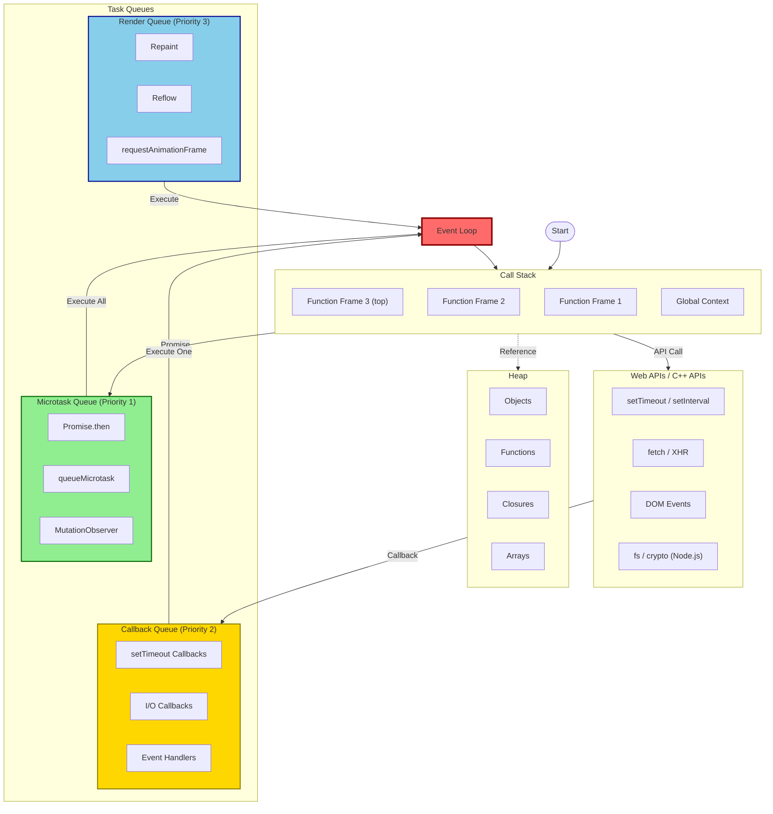

# 18.1 JavaScript Runtime Architecture

The JavaScript Runtime Environment is what allows JavaScript code to run. While JavaScript itself is a single-threaded language, the runtime environment provides the necessary components to handle asynchronous operations, I/O, and other tasks efficiently.

## What is JavaScript Runtime?

JavaScript was originally designed to run only in browsers. Today, JavaScript runs in various environments (browsers, Node.js, Deno, Bun), each providing a runtime that includes:

1. **JavaScript Engine** (V8, SpiderMonkey, JavaScriptCore) - Executes JS code
2. **Web APIs / C++ APIs** - Environment-specific features
3. **Event Loop** - Orchestrates asynchronous operations
4. **Callback Queues** - Hold pending callbacks
5. **Microtask Queue** - High-priority async callbacks
6. **Render Queue** - Browser visual updates

## Visual Architecture Diagram



## Core Components Detailed

### 1. Call Stack

A LIFO data structure that tracks function execution. Each function call creates a stack frame containing arguments, local variables, and return address.

### 2. Heap

Unstructured memory region where objects, functions, closures, and dynamically allocated data are stored. Managed by garbage collection.

### 3. Web APIs / C++ APIs

External features provided by the environment:

- **Browser**: DOM, fetch, setTimeout, IndexedDB, WebSockets
- **Node.js**: fs, crypto, http, child_process, dns

### 4. Callback Queue (Macrotask Queue)

FIFO queue holding callbacks from setTimeout, setInterval, I/O operations, and event listeners.

### 5. Microtask Queue

Higher priority queue for Promise callbacks, queueMicrotask, and MutationObserver. Processed completely before any macrotask.

### 6. Render Queue

Browser-specific queue handling repaints, reflows, and animation frames. Processed between macrotasks.

### 7. Event Loop

Continuous process monitoring the call stack and queues, moving callbacks to the stack when empty.

## How Components Work Together

```javascript
// Complete example demonstrating all runtime components
console.log("1: Start - Call Stack: [global]");

// Web API: setTimeout - Goes to Web API, then Callback Queue
setTimeout(() => {
  console.log("7: setTimeout - From Callback Queue (macrotask)");
}, 0);

// Web API: fetch - Network request
fetch("https://jsonplaceholder.typicode.com/posts/1")
  .then((response) => response.json())
  .then((data) => {
    console.log("6: fetch completed - From Microtask Queue");
  });

// Microtask: Promise
Promise.resolve()
  .then(() => {
    console.log("3: Promise 1 - From Microtask Queue");
  })
  .then(() => {
    console.log("5: Promise 2 - From Microtask Queue");
  });

// Microtask: queueMicrotask
queueMicrotask(() => {
  console.log("4: queueMicrotask - From Microtask Queue");
});

// Synchronous code
console.log("2: End - Call Stack: [global]");

/* Execution Order:
1: Start
2: End
3: Promise 1
4: queueMicrotask
5: Promise 2
6: fetch completed
7: setTimeout

Explanation:
- All microtasks execute before any macrotask
- fetch Promise resolves as microtask
- setTimeout callback is macrotask
*/
```

## Runtime Environment Comparison

### Browser JavaScript Runtime

```javascript
// Browser-specific Web APIs
const element = document.createElement("div");
element.textContent = "Hello Browser!";
document.body.appendChild(element);

// Fetch API for network requests
fetch("https://api.example.com/data")
  .then((response) => response.json())
  .then((data) => console.log(data));

// Timer APIs
const timeoutId = setTimeout(() => {
  console.log("Delayed execution");
}, 1000);

const intervalId = setInterval(() => {
  console.log("Repeated execution");
}, 2000);

// Animation frame (syncs with monitor refresh)
requestAnimationFrame((timestamp) => {
  console.log("Frame at:", timestamp);
});

// DOM events
button.addEventListener("click", () => {
  console.log("Click event - macrotask");
});

// Storage APIs
localStorage.setItem("key", "value");
sessionStorage.setItem("temp", "data");

// IndexedDB for large data
const request = indexedDB.open("MyDB", 1);
```

### Node.js JavaScript Runtime

```javascript
const fs = require("fs");
const crypto = require("crypto");
const http = require("http");
const { spawn } = require("child_process");

// File system API (non-blocking I/O)
fs.readFile("/path/to/file.txt", "utf8", (err, data) => {
  if (err) throw err;
  console.log("File read complete:", data);
});

// Crypto API (uses thread pool)
crypto.pbkdf2("password", "salt", 100000, 64, "sha512", (err, derivedKey) => {
  console.log("Hash generated:", derivedKey.toString("hex"));
});

// HTTP Server
const server = http.createServer((req, res) => {
  res.writeHead(200, { "Content-Type": "text/plain" });
  res.end("Hello Node.js\n");
});
server.listen(3000);

// Child Process
const ls = spawn("ls", ["-la"]);
ls.stdout.on("data", (data) => {
  console.log(`Output: ${data}`);
});

// setImmediate (Node.js macrotask)
setImmediate(() => {
  console.log("setImmediate callback");
});

// process.nextTick (microtask, higher priority than Promise)
process.nextTick(() => {
  console.log("nextTick - Highest priority microtask");
});
```

## Memory and Performance Implications

```javascript
// Understanding runtime memory management

// 1. Stack memory (fast, limited)
function stackExample() {
  let localVar = 42; // Stored on stack
  const primitive = "hello"; // Stored on stack
  // Stack frame cleaned up when function returns
}

// 2. Heap memory (slower, large)
function heapExample() {
  const object = { name: "JavaScript" }; // Stored on heap
  const array = new Array(1000000); // Stored on heap
  // Reference stored on stack, object in heap
}

// 3. Memory leak example
let globalCache = new Map();
function memoryLeak() {
  const largeData = new Array(1000000).fill("data");
  globalCache.set(Date.now(), largeData); // Never cleared - LEAK
}

// 4. Proper cleanup
function noMemoryLeak() {
  const largeData = new Array(1000000).fill("data");
  processData(largeData);
  // No external reference - eligible for GC
}

// 5. Monitoring memory usage
if (performance.memory) {
  setInterval(() => {
    console.log({
      totalHeap: (performance.memory.totalJSHeapSize / 1048576).toFixed(2) + " MB",
      usedHeap: (performance.memory.usedJSHeapSize / 1048576).toFixed(2) + " MB",
      limit: (performance.memory.jsHeapSizeLimit / 1048576).toFixed(2) + " MB",
    });
  }, 5000);
}

// 6. WeakRef for non-critical caching
const cache = new WeakMap();
let data = { id: 1, value: "important" };
cache.set(data, "metadata");
data = null; // Both can be garbage collected
```

## Event Loop Priority Summary

```markdown
PRIORITY ORDER (Highest to Lowest):

1. process.nextTick() [Node.js only]
2. Promise callbacks
3. queueMicrotask()
4. MutationObserver
5. I/O callbacks (fs, network)
6. setTimeout / setInterval
7. setImmediate [Node.js]
8. requestAnimationFrame [Browser]
9. Render events [Browser]
10. Other macrotasks (DOM events, etc.)
```

## Best Practices

```javascript
// 1. Don't block the event loop
// Bad - blocks everything
function badLongOperation() {
  const start = Date.now();
  while (Date.now() - start < 5000) {
    // Blocks for 5 seconds
  }
}

// Good - non-blocking
function goodLongOperation() {
  setTimeout(() => {
    performChunkedWork();
  }, 0);
}

// 2. Use appropriate queues
// High priority async - use microtasks
Promise.resolve().then(() => {
  updateCriticalUI();
});

// Low priority - use macrotasks
setTimeout(() => {
  logAnalytics();
}, 0);

// 3. Avoid deep recursion (can overflow stack)
// Bad
function badRecursion(n) {
  if (n <= 0) return;
  badRecursion(n - 1);
}

// Good
function goodIteration(n) {
  for (let i = 0; i < n; i++) {
    // Process
  }
}

// 4. Clear references for GC
let largeObject = { data: new Array(1000000) };
// After use:
largeObject = null; // Eligible for garbage collection

// 5. Use Web Workers for CPU-intensive tasks
const worker = new Worker("heavy-task.js");
worker.postMessage({ data: largeDataSet });
worker.onmessage = (event) => {
  console.log("Result:", event.data);
};
```
