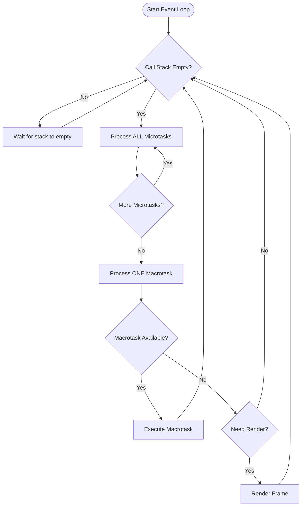

The event loop is the core mechanism that enables JavaScript's asynchronous behavior despite being single-threaded. It continuously monitors the call stack and queues, moving callbacks to the stack when it's empty.

## Event Loop Algorithm



## Simple Event Loop Simulation

```javascript
// Simulating the event loop
class SimpleEventLoop {
  constructor() {
    this.microtasks = [];
    this.macrotasks = [];
    this.running = true;
  }

  // Add microtask
  queueMicrotask(callback) {
    this.microtasks.push(callback);
  }

  // Add macrotask
  queueMacrotask(callback) {
    this.macrotasks.push(callback);
  }

  // Run the event loop
  async run() {
    while (this.running) {
      // Step 1: Process all microtasks
      while (this.microtasks.length > 0) {
        const microtask = this.microtasks.shift();
        try {
          microtask();
        } catch (error) {
          console.error("Microtask error:", error);
        }
      }

      // Step 2: Process one macrotask
      if (this.macrotasks.length > 0) {
        const macrotask = this.macrotasks.shift();
        try {
          macrotask();
        } catch (error) {
          console.error("Macrotask error:", error);
        }
      }

      // Step 3: Allow for rendering (simulated)
      await this.delay(0);
    }
  }

  delay(ms) {
    return new Promise((resolve) => setTimeout(resolve, ms));
  }

  stop() {
    this.running = false;
  }
}

// Demonstration
const loop = new SimpleEventLoop();

loop.queueMacrotask(() => console.log("Macrotask 1"));
loop.queueMicrotask(() => console.log("Microtask 1"));
loop.queueMacrotask(() => console.log("Macrotask 2"));
loop.queueMicrotask(() => console.log("Microtask 2"));
loop.queueMacrotask(() => console.log("Macrotask 3"));

console.log("Event loop starting...");
// loop.run();

// Expected output order:
// Microtask 1
// Microtask 2
// Macrotask 1
// Macrotask 2
// Macrotask 3
```

## Real Event Loop Examples

```javascript
console.log("=== Real Event Loop Examples ===");

// Example 1: Basic event loop flow
function eventLoopExample1() {
  console.log("A: Start - Call Stack: [global]");

  setTimeout(() => {
    console.log("D: Timeout - Macrotask Queue");
  }, 0);

  Promise.resolve().then(() => {
    console.log("C: Promise - Microtask Queue");
  });

  console.log("B: End - Call Stack: [global]");
}

eventLoopExample1();
// Output: A, B, C, D

// Example 2: Nested asynchronous operations
function eventLoopExample2() {
  console.log("1: Start");

  setTimeout(() => {
    console.log("2: Timeout 1");

    Promise.resolve().then(() => {
      console.log("3: Promise inside timeout");
    });

    setTimeout(() => {
      console.log("4: Timeout inside timeout");
    }, 0);
  }, 0);

  Promise.resolve().then(() => {
    console.log("5: Promise 1");

    queueMicrotask(() => {
      console.log("6: Microtask inside promise");
    });
  });

  console.log("7: End");
}

eventLoopExample2();
// Output: 1, 7, 5, 6, 2, 3, 4

// Example 3: Event loop with I/O (Node.js)
const fs = require("fs");

console.log("Start");

fs.readFile(__filename, () => {
  console.log("I/O Callback (Poll phase)");

  setImmediate(() => {
    console.log("setImmediate (Check phase)");
  });

  setTimeout(() => {
    console.log("setTimeout (Timers phase)");
  }, 0);

  Promise.resolve().then(() => {
    console.log("Promise (Microtask)");
  });
});

setTimeout(() => {
  console.log("Top-level setTimeout");
}, 0);

setImmediate(() => {
  console.log("Top-level setImmediate");
});

console.log("End");

// Output order may vary but microtasks always first:
// Start, End, Top-level setTimeout/setImmediate (order varies),
// I/O Callback, Promise, setImmediate, setTimeout
```

## Event Loop Visual Debugging

```javascript
// Visualizing event loop with timestamps
function debugEventLoop(label) {
  const timestamp = performance.now().toFixed(2);
  console.log(`[${timestamp}ms] ${label}`);
}

// Track event loop iterations
let iteration = 0;
const interval = setInterval(() => {
  iteration++;
  debugEventLoop(`Event loop iteration ${iteration} start`);

  // Force microtask
  Promise.resolve().then(() => {
    debugEventLoop(`  Microtask in iteration ${iteration}`);
  });

  debugEventLoop(`Event loop iteration ${iteration} end`);
}, 100);

setTimeout(() => {
  clearInterval(interval);
  debugEventLoop("Monitoring stopped");
}, 1000);

// Detect event loop lag
function detectLag() {
  let lastCheck = Date.now();

  setInterval(() => {
    const now = Date.now();
    const lag = now - lastCheck - 100; // Subtract expected interval

    if (lag > 5) {
      console.warn(`⚠️ Event loop lag detected: ${lag}ms`);
    }

    lastCheck = now;
  }, 100);
}

detectLag();
```

## Event Loop in Different Environments

```javascript
// Browser event loop
if (typeof window !== "undefined") {
  console.log("Browser Event Loop");

  // Rendering happens between tasks
  let frameCount = 0;

  function measureBrowserLoop() {
    const start = performance.now();

    setTimeout(() => {
      console.log("Macrotask completed");
    }, 0);

    Promise.resolve().then(() => {
      console.log("Microtask completed");
    });

    requestAnimationFrame(() => {
      const duration = performance.now() - start;
      console.log(`Frame rendered after ${duration.toFixed(2)}ms`);
    });
  }
}

// Node.js event loop
if (typeof process !== "undefined") {
  console.log("Node.js Event Loop");

  const { performance } = require("perf_hooks");

  // Different phases demonstration
  setTimeout(() => console.log("Timers phase"), 0);
  setImmediate(() => console.log("Check phase"));
  process.nextTick(() => console.log("nextTick (microtask)"));

  // Monitor loop health
  let lastCheck = performance.now();

  setInterval(() => {
    const now = performance.now();
    const delay = now - lastCheck - 1000;

    if (delay > 10) {
      console.log(`Loop blocked for ${delay.toFixed(2)}ms`);
    }

    lastCheck = now;
  }, 1000);
}
```
