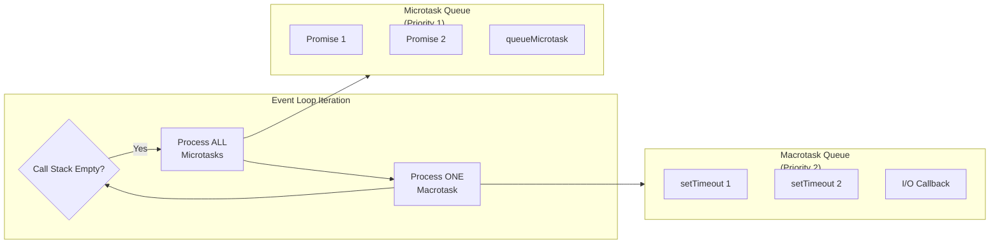

Understanding the critical differences between macrotasks and microtasks is essential for writing performant asynchronous JavaScript code. The key distinction is priority: all microtasks are executed before any macrotask in each event loop iteration.

## Comparison Table

```markdown
| Feature         | Macrotasks                                         | Microtasks                                                       |
| --------------- | -------------------------------------------------- | ---------------------------------------------------------------- |
| **Priority**    | Lower (processed after microtasks)                 | Higher (processed before macrotasks)                             |
| **Processing**  | One per event loop iteration                       | All available per iteration                                      |
| **Examples**    | setTimeout, setInterval, I/O, events, setImmediate | Promise.then, queueMicrotask, MutationObserver, process.nextTick |
| **Blocking**    | Can be starved by continuous microtasks            | Can starve macrotasks if infinite                                |
| **Use Cases**   | I/O operations, timers, UI events                  | State updates, batch operations, cleanup                         |
| **Performance** | Higher overhead per task                           | Lower overhead per task                                          |
```

## Visual Priority Comparison



## Priority Demonstration

```javascript
console.log("=== Priority Demonstration ===");

// Clear demonstration of priority
console.log("Start - Synchronous");

setTimeout(() => {
  console.log("Macrotask: setTimeout");
}, 0);

setImmediate(() => {
  console.log("Macrotask: setImmediate (Node.js)");
});

Promise.resolve()
  .then(() => {
    console.log("Microtask: Promise 1");
  })
  .then(() => {
    console.log("Microtask: Promise 2");
  });

queueMicrotask(() => {
  console.log("Microtask: queueMicrotask");
});

if (typeof process !== "undefined") {
  process.nextTick(() => {
    console.log("Microtask: process.nextTick (highest priority)");
  });
}

console.log("End - Synchronous");

// Expected output:
// Start - Synchronous
// End - Synchronous
// process.nextTick (if Node.js)
// Microtask: Promise 1
// Microtask: queueMicrotask
// Microtask: Promise 2
// Macrotask: setTimeout
// Macrotask: setImmediate

// Nested priority demonstration
function nestedPriority() {
  console.log("\n=== Nested Priority ===");

  setTimeout(() => {
    console.log("Outer macrotask");

    Promise.resolve().then(() => {
      console.log("  Microtask inside macrotask");
    });

    setTimeout(() => {
      console.log("  Nested macrotask");
    }, 0);
  }, 0);

  Promise.resolve().then(() => {
    console.log("Outer microtask");

    queueMicrotask(() => {
      console.log("  Nested microtask");
    });
  });
}

nestedPriority();

// Output:
// Outer microtask
//   Nested microtask
// Outer macrotask
//   Microtask inside macrotask
//   Nested macrotask
```

## Practical Use Cases

```javascript
// 1. State batching with microtasks
class StateManager {
  constructor() {
    this.state = {};
    this.updates = [];
    this.scheduled = false;
  }

  setState(updates) {
    this.updates.push(updates);

    if (!this.scheduled) {
      this.scheduled = true;
      // Use microtask for immediate batch processing
      queueMicrotask(() => {
        this.applyUpdates();
      });
    }
  }

  applyUpdates() {
    const batch = [...this.updates];
    this.updates = [];
    this.scheduled = false;

    // Apply all updates at once
    batch.forEach((update) => {
      Object.assign(this.state, update);
    });

    console.log("State updated:", this.state);
  }
}

const manager = new StateManager();
manager.setState({ count: 1 });
manager.setState({ count: 2 });
manager.setState({ count: 3 });
// Only one update log: State updated: { count: 3 }

// 2. Microtask for cleanup
const resources = new Set();

function acquireResource(id) {
  const resource = { id, acquired: Date.now() };
  resources.add(resource);

  // Schedule cleanup as microtask
  queueMicrotask(() => {
    if (resources.has(resource)) {
      console.log(`Cleanup resource ${id}`);
      resources.delete(resource);
    }
  });

  return resource;
}

acquireResource(1);
acquireResource(2);
console.log(`Active resources: ${resources.size}`); // 2
// After microtask: Active resources: 0

// 3. Macrotask for low-priority work
function lowPriorityWork(data) {
  // Defer heavy processing to avoid blocking UI
  setTimeout(() => {
    const result = heavyComputation(data);
    console.log("Low priority work done:", result);
  }, 0);
}

function heavyComputation(data) {
  // Simulate heavy work
  let result = 0;
  for (let i = 0; i < 1000000; i++) {
    result += data ? 1 : 0;
  }
  return result;
}

// 4. Preventing microtask starvation
class BalancedScheduler {
  constructor() {
    this.taskQueue = [];
    this.maxMicrotasksPerTick = 100;
  }

  schedule(task, priority = "micro") {
    if (priority === "micro") {
      if (this.microtaskCount < this.maxMicrotasksPerTick) {
        queueMicrotask(task);
        this.microtaskCount++;
      } else {
        // Fallback to macrotask to prevent starvation
        setTimeout(task, 0);
        this.microtaskCount = 0;
      }
    } else {
      setTimeout(task, 0);
    }
  }
}

const scheduler = new BalancedScheduler();

for (let i = 0; i < 1000; i++) {
  scheduler.schedule(() => {
    console.log(`Task ${i}`);
  }, "micro");
}
```

## Performance Impact

```javascript
console.log("=== Performance Impact ===");

// Measure microtask overhead
function measureMicrotaskOverhead() {
  console.time("1000 microtasks");
  for (let i = 0; i < 1000; i++) {
    Promise.resolve().then(() => {
      // Empty microtask
    });
  }
  console.timeEnd("1000 microtasks");

  console.time("1000 macrotasks");
  for (let i = 0; i < 1000; i++) {
    setTimeout(() => {}, 0);
  }
  console.timeEnd("1000 macrotasks");
}

measureMicrotaskOverhead();

// Real-world performance difference
let counter = 0;

// Using macrotasks - slower, better for I/O
function incrementWithMacrotask() {
  setTimeout(() => {
    counter++;
    if (counter < 1000) incrementWithMacrotask();
  }, 0);
}

// Using microtasks - faster, can starve event loop
function incrementWithMicrotask() {
  queueMicrotask(() => {
    counter++;
    if (counter < 1000) incrementWithMicrotask();
  });
}

// Benchmark
async function benchmark() {
  counter = 0;
  console.time("Macrotask chain");
  incrementWithMacrotask();
  await new Promise((resolve) => setTimeout(resolve, 100));
  console.timeEnd("Macrotask chain");

  counter = 0;
  console.time("Microtask chain");
  incrementWithMicrotask();
  await new Promise((resolve) => setTimeout(resolve, 100));
  console.timeEnd("Microtask chain");
}

benchmark();
```
