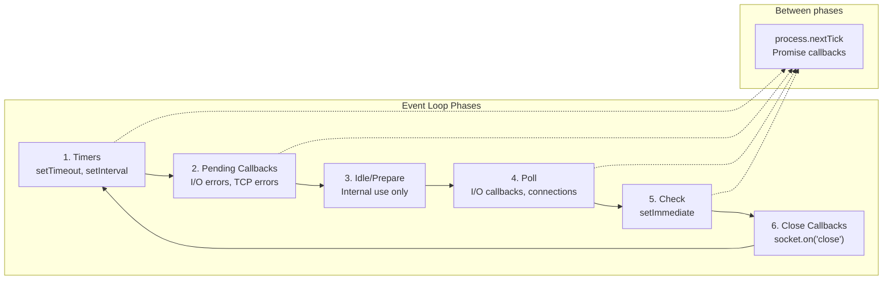

Node.js event loop has a more complex architecture than browsers, with six distinct phases that prioritize different types of operations. Understanding these phases is crucial for writing performant Node.js applications.

## Node.js Event Loop Phases



## Phase Details with Examples

```javascript
console.log("=== Node.js Event Loop Phases ===");

const fs = require("fs");

// Phase 1: Timers
setTimeout(() => {
  console.log("1. Timers phase - setTimeout 0ms");
}, 0);

setTimeout(() => {
  console.log("1. Timers phase - setTimeout 100ms");
}, 100);

setInterval(() => {
  console.log("1. Timers phase - setInterval");
  // Clear after first execution to avoid infinite
  clearInterval(this);
}, 1000);

// Phase 2: Pending Callbacks (I/O errors, TCP errors)
const { exec } = require("child_process");
exec("non-existent-command", (error) => {
  console.log("2. Pending callbacks phase - Error callback");
});

// Phase 3: Idle/Prepare (internal, no user code)

// Phase 4: Poll (I/O callbacks)
fs.readFile(__filename, () => {
  console.log("4. Poll phase - File read I/O callback");

  // Nested operations show phase ordering
  setTimeout(() => {
    console.log("   Nested timer (next timers phase)");
  }, 0);

  setImmediate(() => {
    console.log("   Nested setImmediate (next check phase)");
  });
});

// TCP connection example
const net = require("net");
const server = net.createServer((socket) => {
  console.log("4. Poll phase - New TCP connection");
  socket.end("Goodbye\n");
});
server.listen(8080, () => {
  console.log("Server listening on port 8080");
  // Close server after demo
  setTimeout(() => server.close(), 100);
});

// Phase 5: Check (setImmediate)
setImmediate(() => {
  console.log("5. Check phase - setImmediate 1");
});

setImmediate(() => {
  console.log("5. Check phase - setImmediate 2");
});

// Phase 6: Close Callbacks
server.on("close", () => {
  console.log("6. Close callbacks phase - Server closed");
});

const socket = net.createConnection(80, "example.com");
socket.on("close", () => {
  console.log("6. Close callbacks phase - Socket closed");
});
socket.destroy();

// Microtasks between phases
process.nextTick(() => {
  console.log("nextTick - Executes between phases (highest priority)");
});

Promise.resolve().then(() => {
  console.log("Promise - Microtask between phases");
});

console.log("Main thread - Synchronous code");
```

## Phase Order Demonstration

```javascript
// Demonstrating exact phase order
function demonstratePhaseOrder() {
  console.log("\n=== Phase Order Demonstration ===");

  // Timer phase
  setTimeout(() => {
    console.log("TIMERS: setTimeout 0ms");

    // Nested operations within timer
    Promise.resolve().then(() => console.log("  → Microtask in timer"));
    process.nextTick(() => console.log("  → nextTick in timer"));
  }, 0);

  // I/O phase (Poll)
  fs.readFile(__filename, () => {
    console.log("POLL: File read callback");

    Promise.resolve().then(() => console.log("  → Microtask in poll"));
    process.nextTick(() => console.log("  → nextTick in poll"));

    // Schedule for next phases
    setTimeout(() => console.log("  → Timer scheduled from poll"), 0);
    setImmediate(() => console.log("  → setImmediate scheduled from poll"));
  });

  // Check phase
  setImmediate(() => {
    console.log("CHECK: setImmediate");

    Promise.resolve().then(() => console.log("  → Microtask in check"));
    process.nextTick(() => console.log("  → nextTick in check"));
  });

  // Close phase example
  const server = require("http").createServer();
  server.listen(0, () => {
    server.close(() => {
      console.log("CLOSE: Server close callback");
    });
  });

  // Top-level microtasks
  process.nextTick(() => console.log("TOP-LEVEL nextTick"));
  Promise.resolve().then(() => console.log("TOP-LEVEL Promise"));

  console.log("SYNC: Main thread complete");
}

demonstratePhaseOrder();

// Output order (typical):
// SYNC: Main thread complete
// TOP-LEVEL nextTick
// TOP-LEVEL Promise
// TIMERS: setTimeout 0ms
//   → nextTick in timer
//   → Microtask in timer
// CHECK: setImmediate
//   → nextTick in check
//   → Microtask in check
// POLL: File read callback
//   → nextTick in poll
//   → Microtask in poll
//   → Timer scheduled from poll (next iteration)
//   → setImmediate scheduled from poll (next iteration)
// CLOSE: Server close callback
```

## process.nextTick and setImmediate

```javascript
// Critical difference between nextTick and setImmediate
console.log("=== nextTick vs setImmediate ===");

// nextTick - executes BEFORE next phase
// setImmediate - executes in Check phase

setImmediate(() => {
  console.log("setImmediate: Check phase");
});

setTimeout(() => {
  console.log("setTimeout: Timers phase");
}, 0);

process.nextTick(() => {
  console.log("nextTick: Before next phase");

  // Nested nextTick
  process.nextTick(() => {
    console.log("  nested nextTick");
  });
});

Promise.resolve().then(() => {
  console.log("Promise: Microtask");
});

console.log("Synchronous code");

// Output:
// Synchronous code
// nextTick: Before next phase
// Promise: Microtask
//   nested nextTick
// setTimeout: Timers phase (or setImmediate first - order may vary)
// setImmediate: Check phase

// Avoiding nextTick starvation
let count = 0;

function recursiveNextTick() {
  if (count++ < 100) {
    process.nextTick(recursiveNextTick);
  } else {
    console.log("nextTick recursion complete");
  }
}

// This is dangerous - can starve I/O
function dangerousPattern() {
  process.nextTick(() => {
    console.log("Processing...");
    dangerousPattern(); // Infinite nextTick recursion
  });
}

// Better: use setImmediate for recursion
function betterPattern(n) {
  if (n > 0) {
    console.log(`Processing ${n}`);
    setImmediate(() => betterPattern(n - 1));
  }
}
betterPattern(10);
```

## Node.js Event Loop Configuration

```javascript
// Monitoring event loop phases
const { performance } = require("perf_hooks");

class EventLoopMonitor {
  constructor() {
    this.phases = {
      timers: 0,
      pending: 0,
      poll: 0,
      check: 0,
      close: 0,
    };
  }

  start() {
    // Monitor timers phase
    let lastTimer = performance.now();
    setInterval(() => {
      const now = performance.now();
      this.phases.timers += now - lastTimer;
      lastTimer = now;
    }, 1000);

    // Monitor poll phase
    const fs = require("fs");
    setInterval(() => {
      const start = performance.now();
      fs.readFile(__filename, () => {
        this.phases.poll += performance.now() - start;
      });
    }, 1000);

    // Monitor check phase
    setImmediate(function checkPhase() {
      const start = performance.now();
      setImmediate(() => {
        this.phases.check += performance.now() - start;
        checkPhase();
      });
    });

    // Log stats
    setInterval(() => {
      console.log("Phase timing stats:", this.phases);
    }, 5000);
  }
}

// UV_THREADPOOL_SIZE configuration
process.env.UV_THREADPOOL_SIZE = "8"; // Default is 4

// View event loop configuration
console.log("Event loop config:");
console.log("- UV_THREADPOOL_SIZE:", process.env.UV_THREADPOOL_SIZE || "4 (default)");
console.log("- Platform:", process.platform);
console.log("- Node version:", process.version);

// Detect event loop lag
let lastCheck = performance.now();
setInterval(() => {
  const now = performance.now();
  const lag = now - lastCheck - 1000;

  if (lag > 10) {
    console.warn(`Event loop lag: ${lag.toFixed(2)}ms in ${lag > 50 ? "⚠️ CRITICAL" : "⚠️ WARNING"}`);
  }

  lastCheck = now;
}, 1000);
```
