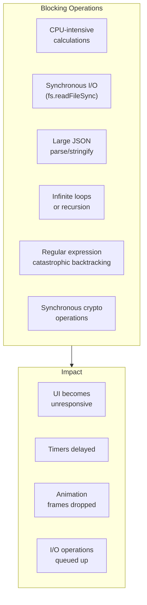

Blocking the event loop occurs when synchronous operations take too long to complete, preventing the event loop from processing other tasks. This leads to unresponsive applications, dropped frames, and poor user experience.

## What Blocks the Event Loop



## Blocking Examples

```javascript
console.log("=== Blocking the Event Loop ===");

// 1. CPU-intensive calculation (BLOCKING)
function blockingCalculation(iterations) {
  const start = Date.now();
  let result = 0;

  for (let i = 0; i < iterations; i++) {
    result += Math.sqrt(i);
  }

  const duration = Date.now() - start;
  console.log(`Calculation blocked for ${duration}ms`);
  return result;
}

// This will block everything
// blockingCalculation(100000000);

// 2. Synchronous file operations (BLOCKING - Node.js)
const fs = require("fs");

function blockingFileRead() {
  const start = Date.now();

  // BLOCKS the event loop
  const data = fs.readFileSync(__filename);

  const duration = Date.now() - start;
  console.log(`File read blocked for ${duration}ms`);

  return data;
}

// 3. Large JSON parsing (BLOCKING)
function blockingJSONParse() {
  const largeObject = { data: new Array(1000000).fill("x") };
  const jsonString = JSON.stringify(largeObject);

  const start = Date.now();
  const parsed = JSON.parse(jsonString);

  const duration = Date.now() - start;
  console.log(`JSON parse blocked for ${duration}ms`);
}

// 4. Infinite loop (BLOCKING - CRITICAL)
function infiniteLoop() {
  // NEVER DO THIS - blocks forever
  // while(true) {}
}

// 5. Regular expression catastrophic backtracking (BLOCKING)
function blockingRegex() {
  const badRegex = /^(a+)+$/;
  const maliciousInput = "a".repeat(20) + "!";

  const start = Date.now();
  try {
    badRegex.test(maliciousInput); // Exponential time complexity
  } catch (e) {}

  const duration = Date.now() - start;
  console.log(`Regex blocked for ${duration}ms`);
}

blockingRegex();
```

## Detecting Blocking Operations

```javascript
// Monitor event loop health
class EventLoopHealthMonitor {
  constructor(threshold = 50) {
    this.threshold = threshold;
    this.interval = null;
    this.lastCheck = process.hrtime.bigint();
  }

  start() {
    this.interval = setInterval(() => {
      const now = process.hrtime.bigint();
      const delay = Number(now - this.lastCheck) / 1e6; // Convert to ms
      this.lastCheck = now;

      if (delay > this.threshold) {
        console.warn(`⚠️ Event loop blocked for ${delay.toFixed(2)}ms`);

        if (delay > 100) {
          console.error(`🔴 CRITICAL: Blocked for ${delay.toFixed(2)}ms`);
          this.printStack();
        }
      }
    }, 100);
  }

  printStack() {
    const stack = new Error().stack;
    console.log("Current stack trace:", stack);
  }

  stop() {
    clearInterval(this.interval);
  }
}

// Use the monitor
const monitor = new EventLoopHealthMonitor(50);
monitor.start();

// Simulate blocking operation
setTimeout(() => {
  console.log("Starting blocking operation...");
  // blockingCalculation(100000000);
  console.log("Blocking operation complete");
}, 1000);

setTimeout(() => {
  console.log("This timer will be delayed by the blocking operation");
}, 500);

// Monitor tools in Node.js
const { performance } = require("perf_hooks");

// Using perf hooks to detect blocking
const obs = new performance.PerformanceObserver((items) => {
  items.getEntries().forEach((entry) => {
    if (entry.duration > 50) {
      console.log(`Long task detected: ${entry.name} took ${entry.duration}ms`);
    }
  });
});
obs.observe({ entryTypes: ["function"] });

// Wrap functions to monitor execution time
function monitorFunction(fn, name) {
  return function (...args) {
    const start = performance.now();
    const result = fn(...args);
    const duration = performance.now() - start;

    if (duration > 50) {
      console.warn(`⚠️ ${name} took ${duration.toFixed(2)}ms - may block event loop`);
    }

    return result;
  };
}
```

## Fixing Blocking Operations

```javascript
// 1. Break work into chunks
function processLargeArrayNonBlocking(array, chunkSize = 1000) {
  let index = 0;

  function processChunk() {
    const chunk = array.slice(index, index + chunkSize);

    // Process chunk
    chunk.forEach((item) => {
      // Do work on item
    });

    index += chunkSize;

    if (index < array.length) {
      // Schedule next chunk - yields to event loop
      setImmediate(processChunk);
      // or: setTimeout(processChunk, 0);
      // or: queueMicrotask(processChunk);
    } else {
      console.log("Processing complete");
    }
  }

  processChunk();
}

// 2. Use Worker Threads for CPU-intensive work (Node.js)
const { Worker } = require("worker_threads");

function runWorker(workerData) {
  return new Promise((resolve, reject) => {
    const worker = new Worker(
      `
            const { parentPort, workerData } = require('worker_threads');
            
            // CPU-intensive work
            let result = 0;
            for (let i = 0; i < workerData.iterations; i++) {
                result += Math.sqrt(i);
            }
            
            parentPort.postMessage(result);
        `,
      { eval: true, workerData },
    );

    worker.on("message", resolve);
    worker.on("error", reject);
    worker.on("exit", (code) => {
      if (code !== 0) reject(new Error(`Worker stopped with exit code ${code}`));
    });
  });
}

// 3. Use Web Workers in browsers
/*
const worker = new Worker('worker.js');
worker.postMessage({ data: largeArray });
worker.onmessage = (event) => {
    console.log('Result:', event.data);
};
*/

// 4. Optimize regular expressions
// Bad - catastrophic backtracking
const badPattern = /^(a+)+$/;

// Good - optimized
const goodPattern = /^a+$/;

// 5. Use streaming for large data
const stream = fs.createReadStream("large-file.json");
let data = "";

stream.on("data", (chunk) => {
  data += chunk;
  // Process chunk incrementally
});

stream.on("end", () => {
  const parsed = JSON.parse(data);
});

// 6. Use setImmediate for recursion (Node.js)
function recursiveNonBlocking(n, max) {
  if (n > max) return;

  // Do work
  console.log(`Processing ${n}`);

  // Yield to event loop
  setImmediate(() => recursiveNonBlocking(n + 1, max));
}

recursiveNonBlocking(0, 1000);
```

## Best Practices to Avoid Blocking

```javascript
// Best Practice 1: Always use async I/O
// Bad
const data = fs.readFileSync("file.txt");

// Good
fs.readFile("file.txt", (err, data) => {
  if (err) throw err;
  // Process data
});

// Best Practice 2: Defer heavy computations
function heavyTask(data) {
  // Defer to next tick
  setImmediate(() => {
    const result = expensiveOperation(data);
    console.log(result);
  });
}

// Best Practice 3: Use caching wisely
const cache = new Map();

function memoize(fn) {
  return function (...args) {
    const key = JSON.stringify(args);
    if (cache.has(key)) {
      return cache.get(key);
    }
    const result = fn(...args);
    cache.set(key, result);
    return result;
  };
}

// Best Practice 4: Timeout for suspicious operations
function withTimeout(promise, timeoutMs) {
  return Promise.race([promise, new Promise((_, reject) => setTimeout(() => reject(new Error("Operation timed out")), timeoutMs))]);
}

// Usage
withTimeout(someAsyncOperation(), 5000).catch((err) => console.error("Timeout or error:", err));

// Best Practice 5: Monitor and log
const start = Date.now();
someOperation();
const duration = Date.now() - start;

if (duration > 100) {
  console.warn(`Slow operation detected: ${duration}ms`);
}
```
