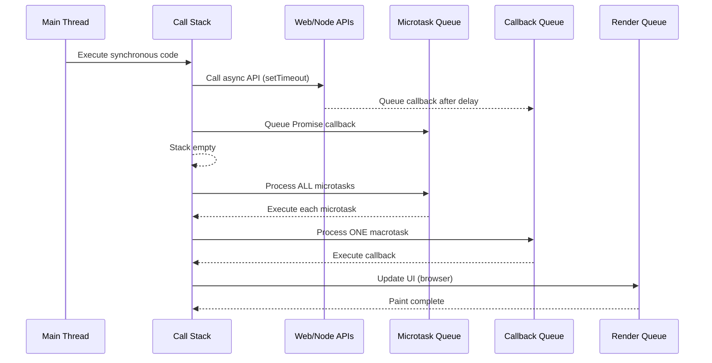

Understanding the event loop becomes easier when we can visualize its behavior. This section provides interactive examples and visual representations to help comprehend how the event loop processes tasks.

## Visual Event Flow



## Visualization Example 1: Basic Flow

```javascript
console.log("=== Visualization 1: Basic Event Flow ===");

// Visual helper
function visualize(label, type = "info") {
  const colors = {
    sync: "🔵",
    micro: "🟢",
    macro: "🟡",
    render: "🟣",
    error: "🔴",
  };
  const icon = colors[type] || "⚪";
  console.log(`${icon} [${type.toUpperCase()}] ${label}`);
}

visualize("Start execution", "sync");

setTimeout(() => {
  visualize("Timeout callback executed", "macro");

  Promise.resolve().then(() => {
    visualize("Promise inside timeout", "micro");
  });
}, 0);

Promise.resolve()
  .then(() => {
    visualize("Promise 1", "micro");
  })
  .then(() => {
    visualize("Promise 2", "micro");
  });

queueMicrotask(() => {
  visualize("queueMicrotask", "micro");
});

visualize("End execution", "sync");

/* Visual output:
🔵 [SYNC] Start execution
🔵 [SYNC] End execution
🟢 [MICRO] Promise 1
🟢 [MICRO] queueMicrotask
🟢 [MICRO] Promise 2
🟡 [MACRO] Timeout callback executed
🟢 [MICRO] Promise inside timeout
*/
```

## Visualization Example 2: Interactive Demo

```javascript
console.log("=== Visualization 2: Interactive Demo ===");

class EventLoopVisualizer {
  constructor() {
    this.events = [];
    this.startTime = Date.now();
  }

  log(event, type) {
    const elapsed = ((Date.now() - this.startTime) / 1000).toFixed(3);
    this.events.push({ time: elapsed, event, type });
    console.log(`[${elapsed}s] ${this.getIcon(type)} ${event}`);
  }

  getIcon(type) {
    const icons = {
      sync: "🔵",
      micro: "🟢",
      macro: "🟡",
      render: "🟣",
      tick: "⚪",
    };
    return icons[type] || "⚪";
  }

  async run() {
    this.log("Event loop started", "sync");

    // Schedule multiple operations
    this.log("Scheduling setTimeout (0ms)", "sync");
    setTimeout(() => {
      this.log("setTimeout 0ms executing", "macro");

      this.log("Scheduling nested setTimeout", "macro");
      setTimeout(() => {
        this.log("Nested setTimeout executing", "macro");
      }, 0);

      this.log("Scheduling Promise from setTimeout", "macro");
      Promise.resolve().then(() => {
        this.log("Promise from setTimeout", "micro");
      });
    }, 0);

    this.log("Scheduling setTimeout (10ms)", "sync");
    setTimeout(() => {
      this.log("setTimeout 10ms executing", "macro");
    }, 10);

    this.log("Creating Promise", "sync");
    Promise.resolve()
      .then(() => {
        this.log("Promise 1", "micro");

        // Nested microtask
        queueMicrotask(() => {
          this.log("Nested queueMicrotask", "micro");
        });
      })
      .then(() => {
        this.log("Promise 2", "micro");
      });

    this.log("Using queueMicrotask", "sync");
    queueMicrotask(() => {
      this.log("queueMicrotask callback", "micro");
    });

    this.log("Synchronous loop (simulated work)", "sync");
    for (let i = 0; i < 3; i++) {
      this.log(`  Loop iteration ${i}`, "sync");
    }

    this.log("Event loop will now process queues", "sync");

    // Wait for all async operations
    await new Promise((resolve) => setTimeout(resolve, 50));

    this.log("Event loop visualization complete", "sync");
    return this.events;
  }
}

const visualizer = new EventLoopVisualizer();
// visualizer.run().then(events => console.log("Events logged:", events.length));
```

## Visualization Example 3: Render Frames

```javascript
console.log("=== Visualization 3: Render Frames ===");

// Browser-style frame visualization
class FrameVisualizer {
  constructor() {
    this.frameCount = 0;
    this.frameTimes = [];
    this.animating = false;
  }

  start() {
    this.animating = true;
    this.logFrame();
  }

  logFrame() {
    if (!this.animating) return;

    const timestamp = performance.now();
    this.frameCount++;

    console.log(`🟣 [FRAME ${this.frameCount}] Started at ${timestamp.toFixed(2)}ms`);

    // Simulate frame work
    this.frameTimes.push(timestamp);

    // Schedule next frame
    requestAnimationFrame(() => this.logFrame());
  }

  stop() {
    this.animating = false;
    console.log(`Total frames: ${this.frameCount}`);

    // Calculate frame rate
    if (this.frameTimes.length > 1) {
      const duration = this.frameTimes[this.frameTimes.length - 1] - this.frameTimes[0];
      const fps = (this.frameTimes.length - 1) / (duration / 1000);
      console.log(`Average FPS: ${fps.toFixed(2)}`);
    }
  }
}

// Demonstration with and without blocking
function demonstrateFrameImpact() {
  console.log("=== Impact of Blocking on Frames ===");

  let frameNumber = 0;
  let lastTime = performance.now();

  function measureFrame() {
    frameNumber++;
    const now = performance.now();
    const delta = now - lastTime;
    lastTime = now;

    console.log(`Frame ${frameNumber}: ${delta.toFixed(2)}ms between frames`);

    // Simulate blocking every 60 frames
    if (frameNumber === 30) {
      console.log("🔴 BLOCKING OPERATION START - UI will freeze");
      const start = Date.now();
      while (Date.now() - start < 100) {
        // Block for 100ms
      }
      console.log("✅ BLOCKING OPERATION END");
    }

    requestAnimationFrame(measureFrame);
  }

  // Uncomment to see impact
  // requestAnimationFrame(measureFrame);
}

// demonstrateFrameImpact();

// Visualizing microtask vs macrotask timing
function visualizeTiming() {
  console.log("\n=== Timing Visualization ===");

  const marks = [];

  function mark(name) {
    const time = performance.now();
    marks.push({ name, time });
    console.log(`${name}: ${time.toFixed(2)}ms`);
  }

  mark("Start");

  setTimeout(() => {
    mark("setTimeout callback");
  }, 0);

  Promise.resolve().then(() => {
    mark("Promise callback");

    setTimeout(() => {
      mark("setTimeout inside promise");
    }, 0);
  });

  setImmediate(() => {
    mark("setImmediate callback (Node.js)");
  });

  mark("End of sync code");

  // Calculate differences
  setTimeout(() => {
    console.log("\n=== Timing Analysis ===");
    for (let i = 1; i < marks.length; i++) {
      const diff = marks[i].time - marks[i - 1].time;
      console.log(`${marks[i - 1].name} → ${marks[i].name}: ${diff.toFixed(3)}ms`);
    }
  }, 100);
}

visualizeTiming();
```

## Visualization Example 4: Event Loop Animation

```javascript
console.log("=== Visualization 4: Event Loop Animation ===");

// Text-based animation of event loop
class TextAnimation {
  constructor() {
    this.iteration = 0;
  }

  animate() {
    const frames = [
      "⣾ Event Loop Running",
      "⣽ Event Loop Running",
      "⣻ Event Loop Running",
      "⢿ Event Loop Running",
      "⡿ Event Loop Running",
      "⣟ Event Loop Running",
      "⣯ Event Loop Running",
      "⣷ Event Loop Running",
    ];

    let frameIndex = 0;
    const interval = setInterval(() => {
      process.stdout.write(`\r${frames[frameIndex]} - Iteration ${this.iteration}`);
      frameIndex = (frameIndex + 1) % frames.length;
    }, 100);

    // Simulate event loop iterations
    const loopInterval = setInterval(() => {
      this.iteration++;

      // Process microtasks (simulated)
      Promise.resolve().then(() => {
        // Microtask work
      });

      if (this.iteration >= 20) {
        clearInterval(interval);
        clearInterval(loopInterval);
        console.log("\n✅ Animation complete");
      }
    }, 500);
  }
}

// const animation = new TextAnimation();
// animation.animate();

// Comprehensive event loop logger
class EventLoopLogger {
  constructor() {
    this.logs = [];
    this.enabled = true;
  }

  logPhase(phase, duration) {
    if (!this.enabled) return;

    const entry = {
      phase,
      duration: duration.toFixed(2),
      timestamp: Date.now(),
    };

    this.logs.push(entry);
    console.log(`📊 [${phase}] took ${entry.duration}ms`);
  }

  async monitor(duration = 5000) {
    console.log("🔍 Starting event loop monitoring...");

    const startTime = Date.now();
    let lastCheck = startTime;

    while (Date.now() - startTime < duration) {
      const now = Date.now();
      const delay = now - lastCheck;
      lastCheck = now;

      if (delay > 10) {
        this.logPhase("Event Loop Lag", delay);
      }

      // Yield to event loop
      await new Promise((resolve) => setImmediate(resolve));
    }

    console.log(`\n📈 Monitoring complete. Collected ${this.logs.length} entries.`);

    // Summary
    const lags = this.logs.filter((l) => l.phase === "Event Loop Lag");
    if (lags.length > 0) {
      const avgLag = lags.reduce((sum, l) => sum + parseFloat(l.duration), 0) / lags.length;
      console.log(`📊 Average lag: ${avgLag.toFixed(2)}ms`);
      console.log(`📊 Maximum lag: ${Math.max(...lags.map((l) => parseFloat(l.duration)))}ms`);
    }

    return this.logs;
  }
}

const logger = new EventLoopLogger();
// logger.monitor(3000);

console.log("\n✅ Event Loop Visualization Complete - Check console output for detailed analysis");
```
